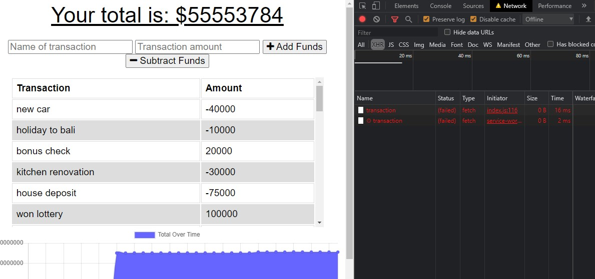
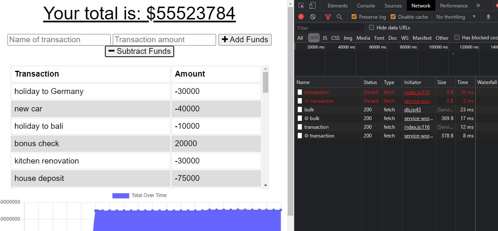

# Budget Tracker

## Description
The aim of this project was to create a progressive web application by adding code to an existing budget tracking application to allow it to store information while offline and then update the application with this information when it is online again. In order to achieve this, the files called service-worker.js, manifest.webmanifest and db.js were added. The service worker allows information to be stored in the cache so if internet connection is lost while using the application, the page will still be able to load. The webmanifest is a JSON file where some of the page information is stored and this tells the application how to display itself on a mobile phone. The db.js is the database that is used when the application is offline so that when the user enters their budget information while offline, it has a place to be saved. When the application comes back online, it is able to do an api call to that database to retrieve the new information and keep the application up to date.
To view the deployed project, please click [here]().

## Table of Contents 

* [Installation](#installation)
* [Usage](#usage)
* [License](#License)
* [Contributing](#contributing)
* [Test](#test)
* [Questions](#questions)

## Installation
The technologies used for this project include JavaScript, Node.js, Manifest, Service Worker. Please install Node.js and start the application using the command "npm start" in the command line. 

## Usage
The screenshot provided shows the application working while offline, there are errors to say that the application cannot be updated while online, but it is evident that the information is being saved still.

In the next screenshot, it shows the application updating itself as it is now back online. 

## License 
Permission is hereby granted, free of charge, to any person obtaining a copy of this software and associated documentation files(the "Software"), to deal in the Software without restriction, including without limitation the rights to use, copy, modify, merge, publish, distribute, sublicense, and / or sell copies of the Software, and to permit persons to whom the Software is furnished to do so, subject to the following conditions: The above copyright notice and this permission notice shall be included in all copies or substantial portions of the Software. THE SOFTWARE IS PROVIDED "AS IS", WITHOUT WARRANTY OF ANY KIND, EXPRESS OR IMPLIED, INCLUDING BUT NOT LIMITED TO THE WARRANTIES OF MERCHANTABILITY, FITNESS FOR A PARTICULAR PURPOSE AND NONINFRINGEMENT.IN NO EVENT SHALL THE AUTHORS OR COPYRIGHT HOLDERS BE LIABLE FOR ANY CLAIM, DAMAGES OR OTHER LIABILITY, WHETHER IN AN ACTION OF CONTRACT, TORT OR OTHERWISE, ARISING FROM, OUT OF OR IN CONNECTION WITH THE SOFTWARE OR THE USE OR OTHER DEALINGS IN THE SOFTWARE.

## Contributing
It is welcome for anybody to contribute to this project according to the licence agreement above. 

## Test
NA

## Questions
If you have any questions or would like further information on this project, 
please contact silviataliana2@gmail.com or find me on [Github](https://github.com/silvia-taliana).
